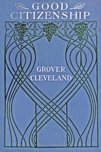

# Good citizenship <kbd>v2.3.0</kbd>

## Authors

 - Cleveland, Grover <small>(1837 - 1908)</small>

## Translators

## Subjects

 - Citizenship
 - Holidays
 - National characteristics, American
 - Patriotism

## Readablility

 - **A1:** 69%
 - **A2:** 76%
 - **B1:** 83%
 - **B2:** 90%
 - **C1:** 97%
 - **C2:** 100%

## Words Count

 - **A1:** 368
 - **A2:** 229
 - **B1:** 317
 - **B2:** 417
 - **C1:** 409
 - **C2:** 205

## Source

<kbd>GUTHENBURGE:68159</kbd>
