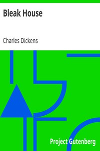

# Bleak House <kbd>GUTHENBURGE</kbd>

## Authors

 - Dickens, Charles <small>(1812 - 1870)</small>

## Translators

## Subjects

 - Bildungsromans
 - Domestic fiction
 - Guardian and ward
 - Illegitimate children
 - Inheritance and succession
 - Legal stories
 - London (England)
 - Young women

## Readablility

 - **A1:** 53%
 - **A2:** 65%
 - **B1:** 77%
 - **B2:** 87%
 - **C1:** 96%
 - **C2:** 100%

## Words Count

 - **A1:** 410
 - **A2:** 489
 - **B1:** 956
 - **B2:** 1805
 - **C1:** 2867
 - **C2:** 2816
