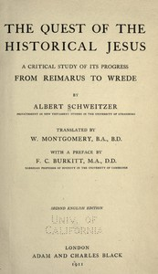

# The Quest of the Historical Jesus: A Critical Study of its Progress from Reimarus to Wrede <kbd>v2.2.1</kbd>

## Authors

 - Schweitzer, Albert <small>(1875 - 1965)</small>

## Translators

 - Montgomery, W. (William) <small>(1871 - 1930)</small>

## Subjects

 - Jesus Christ
 - Jesus Christ

## Readablility

 - **A1:** 75%
 - **A2:** 81%
 - **B1:** 87%
 - **B2:** 93%
 - **C1:** 98%
 - **C2:** 100%

## Words Count

 - **A1:** 492
 - **A2:** 469
 - **B1:** 866
 - **B2:** 1459
 - **C1:** 1899
 - **C2:** 1485

## Source

<kbd>GUTHENBURGE:45422</kbd>
