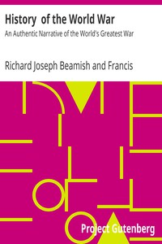

# History  of the World War: An Authentic Narrative of the World's Greatest War <kbd>v2.2.1</kbd>

## Authors

 - March, Francis Andrew <small>(1863 - 1928)</small>
 - Beamish, Richard Joseph <small>(1869 - 1945)</small>

## Translators

## Subjects

 - World War, 1914-1918

## Readablility

 - **A1:** 71%
 - **A2:** 78%
 - **B1:** 85%
 - **B2:** 92%
 - **C1:** 97%
 - **C2:** 100%

## Words Count

 - **A1:** 491
 - **A2:** 488
 - **B1:** 946
 - **B2:** 1699
 - **C1:** 2361
 - **C2:** 1925

## Source

<kbd>GUTHENBURGE:18993</kbd>
