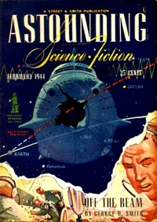

# Off the Beam <kbd>v2.0.2</kbd>

## Authors

 - Smith, George O. (George Oliver) <small>(1911 - 1981)</small>

## Translators

## Subjects

 - Communication
 - Science fiction
 - Space ships
 - Space stations

## Readablility

 - **A1:** 49%
 - **A2:** 57%
 - **B1:** 68%
 - **B2:** 82%
 - **C1:** 86%
 - **C2:** 100%

## Words Count

 - **A1:** 415
 - **A2:** 281
 - **B1:** 417
 - **B2:** 524
 - **C1:** 194
 - **C2:** 857

## Source

<kbd>GUTHENBURGE:68047</kbd>
