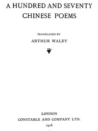

# A Hundred and Seventy Chinese Poems <kbd>v2.3.0</kbd>

## Authors

## Translators

 - Waley, Arthur <small>(1889 - 1966)</small>

## Subjects

 - Chinese poetry

## Readablility

 - **A1:** 72%
 - **A2:** 79%
 - **B1:** 86%
 - **B2:** 92%
 - **C1:** 97%
 - **C2:** 100%

## Words Count

 - **A1:** 480
 - **A2:** 428
 - **B1:** 686
 - **B2:** 964
 - **C1:** 956
 - **C2:** 549

## Source

<kbd>GUTHENBURGE:42290</kbd>
