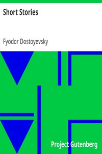

# Short Stories <kbd>v2.3.0</kbd>

## Authors

 - Dostoyevsky, Fyodor <small>(1821 - 1881)</small>

## Translators

## Subjects

 - Dostoyevsky, Fyodor, 1821-1881
 - Russia
 - Short stories, Russian

## Readablility

 - **A1:** 78%
 - **A2:** 84%
 - **B1:** 89%
 - **B2:** 94%
 - **C1:** 98%
 - **C2:** 100%

## Words Count

 - **A1:** 488
 - **A2:** 468
 - **B1:** 829
 - **B2:** 1252
 - **C1:** 1385
 - **C2:** 887

## Source

<kbd>GUTHENBURGE:40745</kbd>
