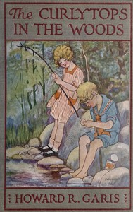

# The Curlytops in the Woods; Or, Fun at the Lumber Camp <kbd>v2.3.0</kbd>

## Authors

 - Garis, Howard Roger <small>(1873 - 1962)</small>

## Translators

## Subjects

 - Adventure stories
 - Brothers and sisters
 - Children
 - Families
 - Lumber camps

## Readablility

 - **A1:** 76%
 - **A2:** 83%
 - **B1:** 88%
 - **B2:** 93%
 - **C1:** 98%
 - **C2:** 100%

## Words Count

 - **A1:** 473
 - **A2:** 359
 - **B1:** 548
 - **B2:** 678
 - **C1:** 573
 - **C2:** 294

## Source

<kbd>GUTHENBURGE:67986</kbd>
