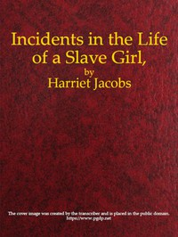

# Incidents in the Life of a Slave Girl, Written by Herself <kbd>v2.2.1</kbd>

## Authors

 - Jacobs, Harriet A. (Harriet Ann) <small>(1813 - 1897)</small>

## Translators

## Subjects

 - Jacobs, Harriet A. (Harriet Ann), 1813-1897
 - Slaves
 - Slaves
 - Women slaves

## Readablility

 - **A1:** 78%
 - **A2:** 84%
 - **B1:** 90%
 - **B2:** 95%
 - **C1:** 99%
 - **C2:** 100%

## Words Count

 - **A1:** 490
 - **A2:** 475
 - **B1:** 857
 - **B2:** 1285
 - **C1:** 1424
 - **C2:** 705

## Source

<kbd>GUTHENBURGE:11030</kbd>
