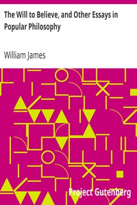

# The Will to Believe, and Other Essays in Popular Philosophy <kbd>v2.2.1</kbd>

## Authors

 - James, William <small>(1842 - 1910)</small>

## Translators

## Subjects

 - Belief and doubt
 - Essays
 - Philosophy

## Readablility

 - **A1:** 74%
 - **A2:** 80%
 - **B1:** 86%
 - **B2:** 92%
 - **C1:** 97%
 - **C2:** 100%

## Words Count

 - **A1:** 489
 - **A2:** 471
 - **B1:** 847
 - **B2:** 1356
 - **C1:** 1786
 - **C2:** 1439

## Source

<kbd>GUTHENBURGE:26659</kbd>
