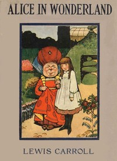

# Alice's Adventures in Wonderland <kbd>v2.0.2</kbd>

## Authors

 - Carroll, Lewis <small>(1832 - 1898)</small>

## Translators

## Subjects

 - Alice (Fictitious character from Carroll)
 - Children's stories
 - Fantasy fiction
 - Imaginary places

## Readablility

 - **A1:** 52%
 - **A2:** 59%
 - **B1:** 70%
 - **B2:** 84%
 - **C1:** 88%
 - **C2:** 100%

## Words Count

 - **A1:** 380
 - **A2:** 238
 - **B1:** 333
 - **B2:** 417
 - **C1:** 135
 - **C2:** 557

## Source

<kbd>GUTHENBURGE:19033</kbd>
