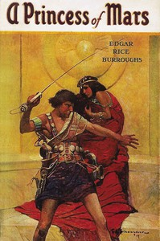

# A Princess of Mars <kbd>v2.0.2</kbd>

## Authors

 - Burroughs, Edgar Rice <small>(1875 - 1950)</small>

## Translators

## Subjects

 - Carter, John (Fictitious character)
 - Dejah Thoris (Fictitious character)
 - Mars (Planet)
 - Princesses
 - Science fiction

## Readablility

 - **A1:** 53%
 - **A2:** 61%
 - **B1:** 71%
 - **B2:** 85%
 - **C1:** 89%
 - **C2:** 100%

## Words Count

 - **A1:** 558
 - **A2:** 530
 - **B1:** 857
 - **B2:** 1359
 - **C1:** 598
 - **C2:** 2936

## Source

<kbd>GUTHENBURGE:62</kbd>
