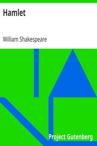

# Hamlet <kbd>v2.3.0</kbd>

## Authors

 - Shakespeare, William <small>(1564 - 1616)</small>

## Translators

## Subjects

 - Denmark
 - Fathers
 - Hamlet (Legendary character)
 - Kings and rulers
 - Murder victims' families
 - Princes
 - Revenge
 - Tragedies

## Readablility

 - **A1:** 82%
 - **A2:** 86%
 - **B1:** 89%
 - **B2:** 93%
 - **C1:** 97%
 - **C2:** 100%

## Words Count

 - **A1:** 414
 - **A2:** 295
 - **B1:** 427
 - **B2:** 544
 - **C1:** 555
 - **C2:** 383

## Source

<kbd>GUTHENBURGE:2265</kbd>
