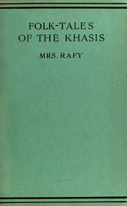

# Folk-Tales of the Khasis <kbd>v2.2.1</kbd>

## Authors

 - Rafy, Mrs. <small>(-1 - -1)</small>

## Translators

## Subjects

 - Khasi (Indic people)

## Readablility

 - **A1:** 75%
 - **A2:** 81%
 - **B1:** 87%
 - **B2:** 93%
 - **C1:** 98%
 - **C2:** 100%

## Words Count

 - **A1:** 480
 - **A2:** 429
 - **B1:** 702
 - **B2:** 1000
 - **C1:** 1012
 - **C2:** 567

## Source

<kbd>GUTHENBURGE:37884</kbd>
