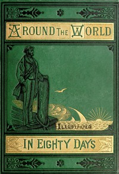

# Around the World in Eighty Days <kbd>GUTHENBURGE</kbd>

## Authors

 - Verne, Jules <small>(1828 - 1905)</small>

## Translators

## Subjects

 - Adventure stories
 - Voyages around the world

## Readablility

 - **A1:** 42%
 - **A2:** 55%
 - **B1:** 71%
 - **B2:** 85%
 - **C1:** 95%
 - **C2:** 100%

## Words Count

 - **A1:** 401
 - **A2:** 457
 - **B1:** 813
 - **B2:** 1219
 - **C1:** 1332
 - **C2:** 759
