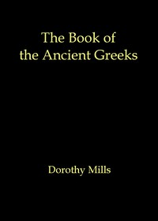

# The book of the ancient Greeks: An Introduction to the History and Civilization of Greece from the Coming of the Greeks to the Conquest of Corinth by Rome in 146 B.C. <kbd>v2.0.2</kbd>

## Authors

 - Mills, Dorothy <small>(-1 - -1)</small>

## Translators

## Subjects

## Readablility

 - **A1:** 54%
 - **A2:** 61%
 - **B1:** 71%
 - **B2:** 84%
 - **C1:** 88%
 - **C2:** 100%

## Words Count

 - **A1:** 623
 - **A2:** 593
 - **B1:** 972
 - **B2:** 1526
 - **C1:** 628
 - **C2:** 3746

## Source

<kbd>GUTHENBURGE:68180</kbd>
