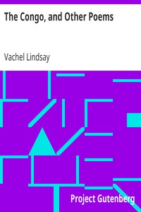

# The Congo, and Other Poems <kbd>v2.3.0</kbd>

## Authors

 - Lindsay, Vachel <small>(1879 - 1931)</small>

## Translators

## Subjects

 - American poetry
 - Narrative poetry

## Readablility

 - **A1:** 68%
 - **A2:** 75%
 - **B1:** 83%
 - **B2:** 90%
 - **C1:** 96%
 - **C2:** 100%

## Words Count

 - **A1:** 456
 - **A2:** 341
 - **B1:** 561
 - **B2:** 722
 - **C1:** 713
 - **C2:** 468

## Source

<kbd>GUTHENBURGE:1021</kbd>
