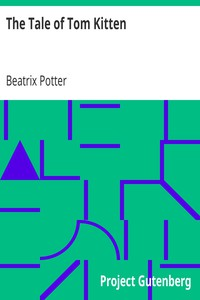

# The Tale of Tom Kitten <kbd>v2.3.0</kbd>

## Authors

 - Potter, Beatrix <small>(1866 - 1943)</small>

## Translators

## Subjects

 - Cats
 - Kittens

## Readablility

 - **A1:** 67%
 - **A2:** 76%
 - **B1:** 85%
 - **B2:** 93%
 - **C1:** 99%
 - **C2:** 100%

## Words Count

 - **A1:** 255
 - **A2:** 100
 - **B1:** 154
 - **B2:** 172
 - **C1:** 110
 - **C2:** 20

## Source

<kbd>GUTHENBURGE:14837</kbd>
