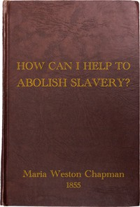

# "How Can I Help to Abolish Slavery?" or, Counsels to the Newly Converted <kbd>v2.3.0</kbd>

## Authors

 - Chapman, Maria Weston <small>(1806 - 1885)</small>

## Translators

## Subjects

 - Abolitionists
 - American Anti-Slavery Society
 - Antislavery movements

## Readablility

 - **A1:** 68%
 - **A2:** 76%
 - **B1:** 84%
 - **B2:** 93%
 - **C1:** 98%
 - **C2:** 100%

## Words Count

 - **A1:** 354
 - **A2:** 212
 - **B1:** 295
 - **B2:** 361
 - **C1:** 266
 - **C2:** 98

## Source

<kbd>GUTHENBURGE:68031</kbd>
