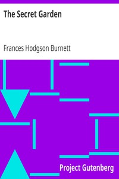

# The Secret Garden <kbd>v2.3.0</kbd>

## Authors

 - Burnett, Frances Hodgson <small>(1849 - 1924)</small>

## Translators

## Subjects

 - Gardens
 - Orphans
 - People with disabilities
 - Yorkshire (England)

## Readablility

 - **A1:** 80%
 - **A2:** 86%
 - **B1:** 91%
 - **B2:** 96%
 - **C1:** 98%
 - **C2:** 100%

## Words Count

 - **A1:** 486
 - **A2:** 423
 - **B1:** 676
 - **B2:** 886
 - **C1:** 881
 - **C2:** 471

## Source

<kbd>GUTHENBURGE:113</kbd>
