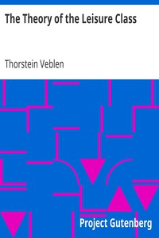

# The Theory of the Leisure Class <kbd>v2.3.0</kbd>

## Authors

 - Veblen, Thorstein <small>(1857 - 1929)</small>

## Translators

## Subjects

 - Leisure class
 - Sociology

## Readablility

 - **A1:** 68%
 - **A2:** 74%
 - **B1:** 80%
 - **B2:** 88%
 - **C1:** 94%
 - **C2:** 100%

## Words Count

 - **A1:** 452
 - **A2:** 363
 - **B1:** 627
 - **B2:** 948
 - **C1:** 1199
 - **C2:** 1135

## Source

<kbd>GUTHENBURGE:833</kbd>
