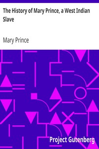

# The History of Mary Prince, a West Indian Slave <kbd>v2.3.0</kbd>

## Authors

 - Prince, Mary <small>(1788 - 1833)</small>

## Translators

## Subjects

 - Fugitive slaves
 - Prince, Mary
 - Slavery

## Readablility

 - **A1:** 77%
 - **A2:** 83%
 - **B1:** 89%
 - **B2:** 95%
 - **C1:** 99%
 - **C2:** 100%

## Words Count

 - **A1:** 480
 - **A2:** 392
 - **B1:** 607
 - **B2:** 753
 - **C1:** 674
 - **C2:** 309

## Source

<kbd>GUTHENBURGE:17851</kbd>
