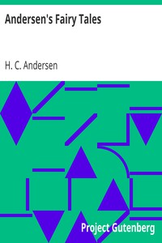

# Andersen's Fairy Tales <kbd>v2.3.0</kbd>

## Authors

 - Andersen, H. C. (Hans Christian) <small>(1805 - 1875)</small>

## Translators

## Subjects

 - Children's stories, Danish
 - Fairy tales
 - Fairy tales

## Readablility

 - **A1:** 77%
 - **A2:** 83%
 - **B1:** 89%
 - **B2:** 95%
 - **C1:** 98%
 - **C2:** 100%

## Words Count

 - **A1:** 492
 - **A2:** 447
 - **B1:** 757
 - **B2:** 1035
 - **C1:** 1019
 - **C2:** 535

## Source

<kbd>GUTHENBURGE:1597</kbd>
