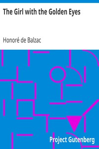

# The Girl with the Golden Eyes <kbd>v2.2.1</kbd>

## Authors

 - Balzac, Honoré de <small>(1799 - 1850)</small>

## Translators

 - Marriage, Ellen <small>(1865 - 1946)</small>

## Subjects

 - Brothers and sisters
 - France
 - French fiction
 - Man-woman relationships

## Readablility

 - **A1:** 74%
 - **A2:** 80%
 - **B1:** 87%
 - **B2:** 92%
 - **C1:** 97%
 - **C2:** 100%

## Words Count

 - **A1:** 490
 - **A2:** 442
 - **B1:** 698
 - **B2:** 918
 - **C1:** 929
 - **C2:** 573

## Source

<kbd>GUTHENBURGE:1659</kbd>
