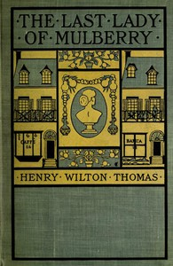

# The Last Lady of Mulberry: A Story of Italian New York <kbd>v2.2.1</kbd>

## Authors

 - Thomas, Henry Wilton <small>(1867 - -1)</small>

## Translators

## Subjects

 - Italian Americans

## Readablility

 - **A1:** 75%
 - **A2:** 81%
 - **B1:** 86%
 - **B2:** 92%
 - **C1:** 97%
 - **C2:** 100%

## Words Count

 - **A1:** 490
 - **A2:** 473
 - **B1:** 804
 - **B2:** 1207
 - **C1:** 1391
 - **C2:** 1027

## Source

<kbd>GUTHENBURGE:68009</kbd>
