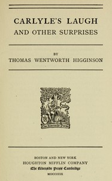

# Carlyle's laugh, and other surprises <kbd>v2.3.0</kbd>

## Authors

 - Higginson, Thomas Wentworth <small>(1823 - 1911)</small>

## Translators

## Subjects

 - American literature
 - Authors, American

## Readablility

 - **A1:** 75%
 - **A2:** 81%
 - **B1:** 87%
 - **B2:** 93%
 - **C1:** 98%
 - **C2:** 100%

## Words Count

 - **A1:** 494
 - **A2:** 482
 - **B1:** 876
 - **B2:** 1444
 - **C1:** 1671
 - **C2:** 1088

## Source

<kbd>GUTHENBURGE:68129</kbd>
