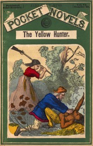

# The Yellow Hunter; or, The Winding Trail of Death <kbd>v2.3.0</kbd>

## Authors

 - Harbaugh, T. C. (Thomas Chalmers) <small>(1849 - 1924)</small>

## Translators

## Subjects

 - Adventure stories
 - Dime novels
 - Frontier and pioneer life
 - Indians of North America

## Readablility

 - **A1:** 72%
 - **A2:** 78%
 - **B1:** 84%
 - **B2:** 91%
 - **C1:** 97%
 - **C2:** 100%

## Words Count

 - **A1:** 468
 - **A2:** 376
 - **B1:** 584
 - **B2:** 804
 - **C1:** 785
 - **C2:** 428

## Source

<kbd>GUTHENBURGE:67958</kbd>
