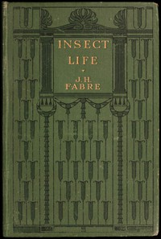

# Insect life: Souvenirs of a naturalist <kbd>v2.3.0</kbd>

## Authors

 - Fabre, Jean-Henri <small>(1823 - 1915)</small>

## Translators

 - Roberts, Margaret <small>(-1 - -1)</small>

## Subjects

## Readablility

 - **A1:** 72%
 - **A2:** 77%
 - **B1:** 84%
 - **B2:** 91%
 - **C1:** 96%
 - **C2:** 100%

## Words Count

 - **A1:** 487
 - **A2:** 458
 - **B1:** 825
 - **B2:** 1311
 - **C1:** 1660
 - **C2:** 1227

## Source

<kbd>GUTHENBURGE:68186</kbd>
