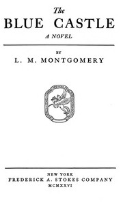

# The Blue Castle: a novel <kbd>v2.0.2</kbd>

## Authors

 - Montgomery, L. M. (Lucy Maud) <small>(1874 - 1942)</small>

## Translators

## Subjects

 - Canada
 - Choice
 - Love
 - Romance fiction
 - Self-actualization (Psychology)
 - Single women
 - Young adult fiction

## Readablility

 - **A1:** 52%
 - **A2:** 58%
 - **B1:** 68%
 - **B2:** 80%
 - **C1:** 84%
 - **C2:** 100%

## Words Count

 - **A1:** 553
 - **A2:** 476
 - **B1:** 833
 - **B2:** 1288
 - **C1:** 529
 - **C2:** 3711

## Source

<kbd>GUTHENBURGE:67979</kbd>
