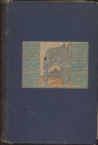

# Following the Equator: A Journey Around the World <kbd>v2.3.0</kbd>

## Authors

 - Twain, Mark <small>(1835 - 1910)</small>

## Translators

## Subjects

 - Equator
 - Twain, Mark, 1835-1910
 - Voyages around the world

## Readablility

 - **A1:** 75%
 - **A2:** 81%
 - **B1:** 87%
 - **B2:** 93%
 - **C1:** 97%
 - **C2:** 100%

## Words Count

 - **A1:** 495
 - **A2:** 496
 - **B1:** 981
 - **B2:** 1820
 - **C1:** 2728
 - **C2:** 2328

## Source

<kbd>GUTHENBURGE:2895</kbd>
