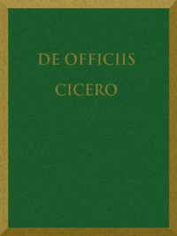

# De Officiis <kbd>v2.3.0</kbd>

## Authors

 - Cicero, Marcus Tullius <small>(-106 - -43)</small>

## Translators

 - Miller, Walter <small>(1864 - 1949)</small>

## Subjects

 - Ethics

## Readablility

 - **A1:** 77%
 - **A2:** 82%
 - **B1:** 86%
 - **B2:** 91%
 - **C1:** 95%
 - **C2:** 100%

## Words Count

 - **A1:** 482
 - **A2:** 434
 - **B1:** 748
 - **B2:** 1160
 - **C1:** 1424
 - **C2:** 963

## Source

<kbd>GUTHENBURGE:47001</kbd>
