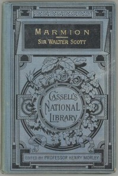

# Marmion: A Tale Of Flodden Field <kbd>v2.2.1</kbd>

## Authors

 - Scott, Walter <small>(1771 - 1832)</small>

## Translators

## Subjects

 - Flodden, Battle of, England, 1513

## Readablility

 - **A1:** 69%
 - **A2:** 75%
 - **B1:** 82%
 - **B2:** 89%
 - **C1:** 96%
 - **C2:** 100%

## Words Count

 - **A1:** 467
 - **A2:** 386
 - **B1:** 643
 - **B2:** 973
 - **C1:** 1176
 - **C2:** 850

## Source

<kbd>GUTHENBURGE:4010</kbd>
