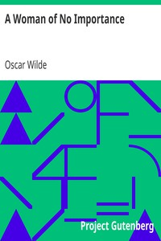

# A Woman of No Importance <kbd>v2.3.0</kbd>

## Authors

 - Wilde, Oscar <small>(1854 - 1900)</small>

## Translators

## Subjects

 - English drama
 - Man-woman relationships

## Readablility

 - **A1:** 82%
 - **A2:** 88%
 - **B1:** 92%
 - **B2:** 96%
 - **C1:** 99%
 - **C2:** 100%

## Words Count

 - **A1:** 454
 - **A2:** 351
 - **B1:** 447
 - **B2:** 507
 - **C1:** 419
 - **C2:** 138

## Source

<kbd>GUTHENBURGE:854</kbd>
