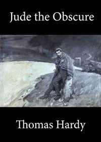

# Jude the Obscure <kbd>v2.2.1</kbd>

## Authors

 - Hardy, Thomas <small>(1840 - 1928)</small>

## Translators

## Subjects

 - Adultery
 - Children
 - Didactic fiction
 - Illegitimate children
 - Love stories
 - Stonemasons
 - Unmarried couples
 - Wessex (England)

## Readablility

 - **A1:** 79%
 - **A2:** 84%
 - **B1:** 89%
 - **B2:** 95%
 - **C1:** 98%
 - **C2:** 100%

## Words Count

 - **A1:** 491
 - **A2:** 488
 - **B1:** 939
 - **B2:** 1624
 - **C1:** 2116
 - **C2:** 1642

## Source

<kbd>GUTHENBURGE:153</kbd>
