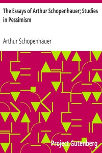

# The Essays of Arthur Schopenhauer; Studies in Pessimism <kbd>v2.2.1</kbd>

## Authors

 - Schopenhauer, Arthur <small>(1788 - 1860)</small>

## Translators

 - Saunders, T. Bailey (Thomas Bailey) <small>(1860 - 1928)</small>

## Subjects

 - Pessimism

## Readablility

 - **A1:** 75%
 - **A2:** 82%
 - **B1:** 88%
 - **B2:** 94%
 - **C1:** 98%
 - **C2:** 100%

## Words Count

 - **A1:** 468
 - **A2:** 381
 - **B1:** 673
 - **B2:** 860
 - **C1:** 814
 - **C2:** 445

## Source

<kbd>GUTHENBURGE:10732</kbd>
