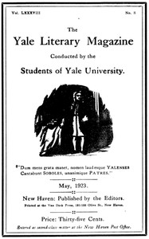

# The Yale Literary Magazine (Vol. LXXXVIII, No. 8) <kbd>v2.2.1</kbd>

## Authors

 - Various <small>(-1 - -1)</small>

## Translators

## Subjects

 - College students' writings, American
 - Yale University

## Readablility

 - **A1:** 72%
 - **A2:** 79%
 - **B1:** 86%
 - **B2:** 92%
 - **C1:** 97%
 - **C2:** 100%

## Words Count

 - **A1:** 460
 - **A2:** 357
 - **B1:** 497
 - **B2:** 581
 - **C1:** 517
 - **C2:** 309

## Source

<kbd>GUTHENBURGE:68046</kbd>
