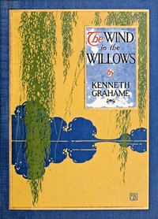

# The Wind in the Willows <kbd>v2.2.1</kbd>

## Authors

 - Grahame, Kenneth <small>(1859 - 1932)</small>

## Translators

## Subjects

 - Animals
 - Country life
 - England
 - Fantasy fiction
 - Friendship
 - Humorous stories
 - Pastoral fiction
 - River life

## Readablility

 - **A1:** 74%
 - **A2:** 80%
 - **B1:** 86%
 - **B2:** 91%
 - **C1:** 96%
 - **C2:** 100%

## Words Count

 - **A1:** 488
 - **A2:** 452
 - **B1:** 789
 - **B2:** 1186
 - **C1:** 1243
 - **C2:** 808

## Source

<kbd>GUTHENBURGE:27805</kbd>
