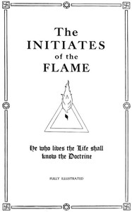

# The Initiates of the Flame <kbd>v2.2.1</kbd>

## Authors

 - Hall, Manly P. (Manly Palmer) <small>(1901 - 1990)</small>

## Translators

## Subjects

 - Occultism
 - Symbolism

## Readablility

 - **A1:** 73%
 - **A2:** 79%
 - **B1:** 86%
 - **B2:** 93%
 - **C1:** 97%
 - **C2:** 100%

## Words Count

 - **A1:** 425
 - **A2:** 276
 - **B1:** 375
 - **B2:** 447
 - **C1:** 360
 - **C2:** 199

## Source

<kbd>GUTHENBURGE:55687</kbd>
