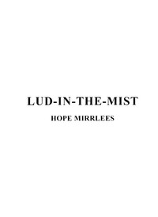

# Lud-in-the-Mist <kbd>v2.0.2</kbd>

## Authors

 - Mirrlees, Hope <small>(1887 - 1978)</small>

## Translators

## Subjects

 - Fairies
 - Fantasy fiction
 - Imaginary places

## Readablility

 - **A1:** 51%
 - **A2:** 58%
 - **B1:** 69%
 - **B2:** 81%
 - **C1:** 85%
 - **C2:** 100%

## Words Count

 - **A1:** 579
 - **A2:** 525
 - **B1:** 934
 - **B2:** 1469
 - **C1:** 675
 - **C2:** 4412

## Source

<kbd>GUTHENBURGE:68061</kbd>
