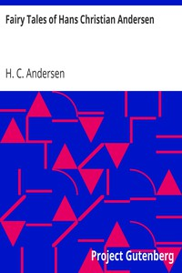

# Fairy Tales of Hans Christian Andersen <kbd>v2.2.1</kbd>

## Authors

 - Andersen, H. C. (Hans Christian) <small>(1805 - 1875)</small>

## Translators

## Subjects

 - Children's stories, Danish
 - Fairy tales
 - Fairy tales
 - Short stories

## Readablility

 - **A1:** 77%
 - **A2:** 83%
 - **B1:** 89%
 - **B2:** 94%
 - **C1:** 98%
 - **C2:** 100%

## Words Count

 - **A1:** 494
 - **A2:** 493
 - **B1:** 971
 - **B2:** 1725
 - **C1:** 2490
 - **C2:** 1953

## Source

<kbd>GUTHENBURGE:27200</kbd>
