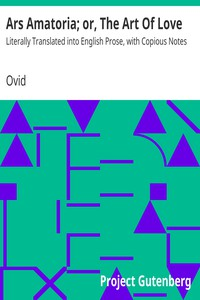

# Ars Amatoria; or, The Art Of Love: Literally Translated into English Prose, with Copious Notes <kbd>v2.2.1</kbd>

## Authors

 - Ovid <small>(-43 - 17)</small>

## Translators

 - Riley, Henry T. (Henry Thomas) <small>(1816 - 1878)</small>

## Subjects

 - Latin poetry
 - Latin poetry

## Readablility

 - **A1:** 75%
 - **A2:** 81%
 - **B1:** 87%
 - **B2:** 92%
 - **C1:** 97%
 - **C2:** 100%

## Words Count

 - **A1:** 477
 - **A2:** 412
 - **B1:** 641
 - **B2:** 917
 - **C1:** 959
 - **C2:** 580

## Source

<kbd>GUTHENBURGE:47677</kbd>
