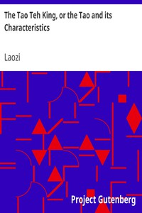

# The Tao Teh King, or the Tao and its Characteristics <kbd>v2.3.0</kbd>

## Authors

 - Laozi <small>(-1 - -1)</small>

## Translators

 - Legge, James <small>(1815 - 1897)</small>

## Subjects

 - Philosophy, Chinese
 - Taoism

## Readablility

 - **A1:** 75%
 - **A2:** 81%
 - **B1:** 87%
 - **B2:** 93%
 - **C1:** 98%
 - **C2:** 100%

## Words Count

 - **A1:** 404
 - **A2:** 265
 - **B1:** 356
 - **B2:** 440
 - **C1:** 373
 - **C2:** 169

## Source

<kbd>GUTHENBURGE:216</kbd>
