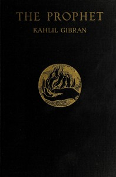

# The Prophet <kbd>GUTHENBURGE</kbd>

## Authors

 - Gibran, Kahlil <small>(1883 - 1931)</small>

## Translators

## Subjects

 - Mysticism
 - Prose poems, American

## Readablility

 - **A1:** 53%
 - **A2:** 60%
 - **B1:** 72%
 - **B2:** 87%
 - **C1:** 91%
 - **C2:** 100%

## Words Count

 - **A1:** 366
 - **A2:** 226
 - **B1:** 387
 - **B2:** 510
 - **C1:** 226
 - **C2:** 770

## Tagger Version

v2.0.0
