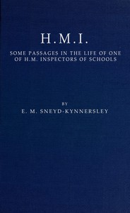

# H.M.I.: Some Passages in the Life of One of H.M. Inspectors of Schools <kbd>v2.3.0</kbd>

## Authors

 - Sneyd-Kynnersley, E. M. (Edmund McKenzie) <small>(1841 - 1933)</small>

## Translators

## Subjects

 - Education
 - School management and organization

## Readablility

 - **A1:** 75%
 - **A2:** 81%
 - **B1:** 86%
 - **B2:** 92%
 - **C1:** 97%
 - **C2:** 100%

## Words Count

 - **A1:** 495
 - **A2:** 492
 - **B1:** 933
 - **B2:** 1527
 - **C1:** 1920
 - **C2:** 1404

## Source

<kbd>GUTHENBURGE:67987</kbd>
