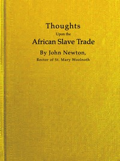

# Thoughts upon the African slave trade <kbd>v2.3.0</kbd>

## Authors

 - Newton, John <small>(1725 - 1807)</small>

## Translators

## Subjects

 - Slave trade
 - Slavery

## Readablility

 - **A1:** 72%
 - **A2:** 79%
 - **B1:** 87%
 - **B2:** 94%
 - **C1:** 98%
 - **C2:** 100%

## Words Count

 - **A1:** 419
 - **A2:** 266
 - **B1:** 355
 - **B2:** 445
 - **C1:** 358
 - **C2:** 135

## Source

<kbd>GUTHENBURGE:68056</kbd>
