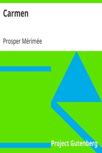

# Carmen <kbd>v2.3.0</kbd>

## Authors

 - Mérimée, Prosper <small>(1803 - 1870)</small>

## Translators

 - Loyd, Mary, Lady <small>(1853 - 1936)</small>

## Subjects

 - Carmen (Fictitious character)
 - Spain

## Readablility

 - **A1:** 77%
 - **A2:** 83%
 - **B1:** 89%
 - **B2:** 94%
 - **C1:** 98%
 - **C2:** 100%

## Words Count

 - **A1:** 478
 - **A2:** 406
 - **B1:** 631
 - **B2:** 763
 - **C1:** 619
 - **C2:** 317

## Source

<kbd>GUTHENBURGE:2465</kbd>
