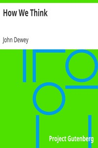

# How We Think <kbd>v2.2.1</kbd>

## Authors

 - Dewey, John <small>(1859 - 1952)</small>

## Translators

## Subjects

 - Educational psychology
 - Thought and thinking

## Readablility

 - **A1:** 67%
 - **A2:** 73%
 - **B1:** 82%
 - **B2:** 90%
 - **C1:** 96%
 - **C2:** 100%

## Words Count

 - **A1:** 468
 - **A2:** 393
 - **B1:** 664
 - **B2:** 1047
 - **C1:** 1205
 - **C2:** 976

## Source

<kbd>GUTHENBURGE:37423</kbd>
