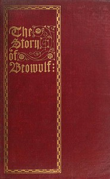

# The Story of Beowulf, Translated from Anglo-Saxon into Modern English Prose <kbd>v2.3.0</kbd>

## Authors

## Translators

 - Kirtlan, Ernest J. B. <small>(-1 - -1)</small>

## Subjects

 - Beowulf
 - Epic poetry, English (Old)
 - Heroes
 - Monsters

## Readablility

 - **A1:** 75%
 - **A2:** 81%
 - **B1:** 86%
 - **B2:** 93%
 - **C1:** 98%
 - **C2:** 100%

## Words Count

 - **A1:** 466
 - **A2:** 351
 - **B1:** 563
 - **B2:** 743
 - **C1:** 675
 - **C2:** 345

## Source

<kbd>GUTHENBURGE:50742</kbd>
