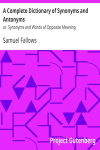

# A Complete Dictionary of Synonyms and Antonyms: or, Synonyms and Words of Opposite Meaning <kbd>v2.2.1</kbd>

## Authors

 - Fallows, Samuel <small>(1835 - 1922)</small>

## Translators

## Subjects

 - English language

## Readablility

 - **A1:** 30%
 - **A2:** 35%
 - **B1:** 42%
 - **B2:** 59%
 - **C1:** 74%
 - **C2:** 97%

## Words Count

 - **A1:** 417
 - **A2:** 394
 - **B1:** 729
 - **B2:** 1325
 - **C1:** 2372
 - **C2:** 4123

## Source

<kbd>GUTHENBURGE:51155</kbd>
