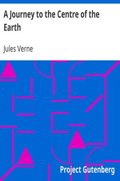

# A Journey to the Centre of the Earth <kbd>v2.2.1</kbd>

## Authors

 - Verne, Jules <small>(1828 - 1905)</small>

## Translators

## Subjects

 - Adventure stories
 - Earth (Planet)
 - Science fiction
 - Voyages, Imaginary

## Readablility

 - **A1:** 73%
 - **A2:** 79%
 - **B1:** 86%
 - **B2:** 93%
 - **C1:** 98%
 - **C2:** 100%

## Words Count

 - **A1:** 487
 - **A2:** 474
 - **B1:** 866
 - **B2:** 1373
 - **C1:** 1588
 - **C2:** 1031

## Source

<kbd>GUTHENBURGE:18857</kbd>
